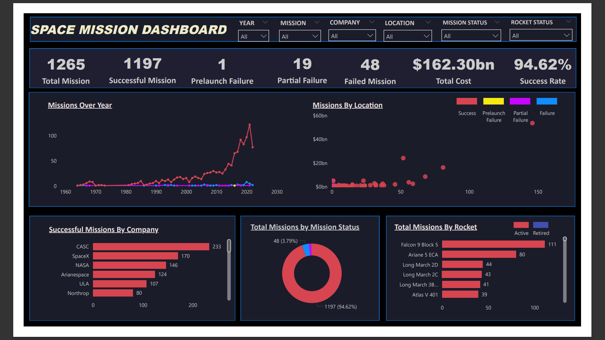

# Space Missions Analysis

The space missions analysis project provides insights into various aspects of space exploration, including successful missions, failures, costs, and more. By visualizing the data using Power BI, users can gain valuable insights into the trends and patterns of space missions as of August 2022.

## Data Overview

The dataset includes the following fields:

- **Company:** The company responsible for the space mission.
- **Location:** The launch location.
- **Date:** The date of the launch.
- **Time (UTC):** The time of the launch in Coordinated Universal Time (UTC).
- **Rocket Name:** The name of the rocket used for the mission.
- **Mission Name:** The name of the space mission(s).
- **Rocket Status (August 2022):** The status of the rocket as of August 2022 (Active or Inactive).
- **Rocket Cost (Millions USD):** The cost of the rocket in millions of US dollars.
- **Mission Status:** The status of the mission (Success, Failure, Partial Failure, Prelaunch Failure).

## Getting Started

To explore the space missions analysis:

1. Download and install [Power BI Desktop](https://powerbi.microsoft.com/en-us/desktop/).
2. Clone or download this repository to your local machine.
3. Open the Power BI project file (.pbix) using Power BI Desktop.
4. Refresh the data if necessary to ensure you have the latest information.
5. Explore the various visualizations and dashboards to gain insights into space missions data.

## Key Insights

- **Success Rate:** Analyze the success rate of space missions over time.
- **Cost Analysis:** Explore the cost of rockets used in missions.
- **Company Comparison:** Compare the performance of different companies in terms of successful missions.
- **Launch Location Analysis:** Visualize the distribution of launch locations and their impact on mission success.

## Contributing

Contributions to enhance this space missions analysis project are welcome! Feel free to fork the repository, make improvements, and submit pull requests.

